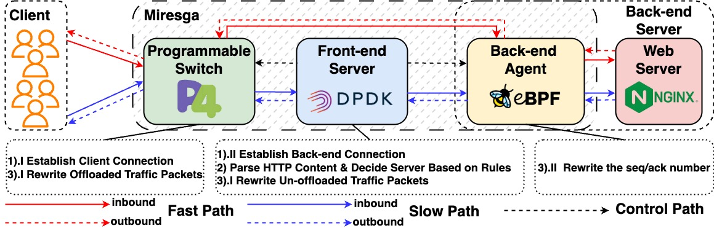

# Miresga 
[](https://doi.org/10.5281/zenodo.14722667)
## I. Introduction
This repository hosts Miresga, a hybrid and high-performance layer-7 load balancing system. The core idea of Miresga is to improve the performance of L7 load balancing by strategically dividing the task to maximize the use of software and hardware resources and capabilities. Through careful observation, we divide L7 load balancing into three distinct tasks: 1. establishing connections with clients and servers respectively, 2. passing application layer protocols and applying load balancing rules, and 3. subsequent packet forwarding through splicing connections. Miresga uses three components to complete these three tasks: the programmable switch, the front-end server and the back-end agent. The architecture of Miresga is shown below.




## II. Requirement
### 1. Programmable Switch
We have only fully tested our prototype on SDE 9.4.0. While our data plane was successfully compiled on a virtual machine with SDE 9.13.1, the API for the control plane seems to be inconsistent. Therefore, using a higher version may require some modifications to the code.

### 2. Front-end Server
We tested on Ubuntu 20.04 with the 5.4.0-196-generic kernel and DPDK-19.11. Using a more recent version of DPDK may also require updating some APIs in the code. Additionally, the following are required to build the project: **cmake**, **meson**, and **ninja**. You can install them by running:
```bash
sudo apt install build-essential meson ninja cmake
```

### 3. Back-end Agent
To run the backend agent, you may need to install the following:
```bash
sudo apt install clang llvm libelf1 libelf-dev libbpf-dev zlib1g-dev
```

The versions of clang and llvm must be higher than 11.0.0. Therefore, for Ubuntu 20.04, you may need to install specific versions:

```bash
sudo apt install clang-11 llvm-11
```
and then modify the Makefile in the Backend directory.

We have only tested the XDP native mode on Mellanox CX6 NICs and have not tested with other NICs, so additional modifications may be required for other cards.

## III. Quick Start
First, clone the repository:
```bash
git clone --recurse-submodules https://github.com/Miresga-L7LB/Miresga.git 
git submodule init
```
### 1. Programmable Switch
#### a. Data plane
On SDE 9.4.0, we used the following code to compile:
```bash
cd $SDE
./p4_build.sh /path/to/Miresga/Switch/data_plane/l7lb_switch.p4
```
#### b. Control plane
```bash
cd /path/to/Miresga/Switch/control_plane
make
```
#### c. Running
```bash
cd /path/to/Miresga/Switch/control_plane
./l7lb_control_plane
```

### 2. Front-end Server
```bash
cd /path/to/Miresga/Frontend
meson build
ninja -C build
cd build
sudo su
./L7LB_Server
```

### 3. Back-end Server
```bash
cd /path/to/Miresga/Backend
make
cd build
sudo su
./xdp_loader ${iface_name}
```
You need to replace `${iface_name}` with the actual network interface name.
If you want to unload the eBPF program, execute:
```bash
cd /path/to/Miresga/Backend
sudo su
sh unload.sh ${iface_name}
```