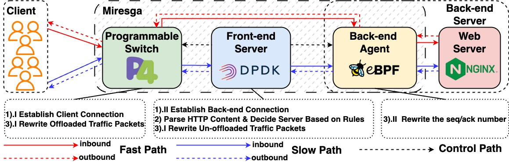

# Miresga 
[](https://doi.org/10.5281/zenodo.14792351)
## I. Introduction
This repository hosts Miresga, a hybrid and high-performance layer-7 load balancing system. The core idea of Miresga is to improve the performance of L7 load balancing by strategically dividing the task to maximize the use of software and hardware resources and capabilities. Through careful observation, we divide L7 load balancing into three distinct tasks: 1. establishing connections with clients and servers respectively, 2. passing application layer protocols and applying load balancing rules, and 3. subsequent packet forwarding through splicing connections. Miresga uses three components to complete these three tasks: the programmable switch, the front-end server and the back-end agent. The architecture of Miresga is shown below.




## II. Requirement
### 1. Programmable Switch
We have only fully tested our prototype on SDE 9.4.0. While our data plane was successfully compiled on a virtual machine with SDE 9.13.1, the API for the control plane seems to be inconsistent. Therefore, using a higher version may require some modifications to the code.

### 2. Front-end Server
We tested on Ubuntu 24.04 with the 6.8.0-86-generic kernel and DPDK in DOCA-2.9.3. Additionally, `cmake` is required to build the project:  You can install it by running:
```bash
sudo apt install cmake
```
We also use `boost.unordered.concurrent_flat_map` as our concurrent hash map. We only test on Version 1.89.0. So you may need to download and install `boost` from [here](https://www.boost.org/releases/latest/).

### 3. Back-end Agent
To run the backend agent, you may need to install the following:
```bash
sudo apt install clang llvm libelf1 libelf-dev libbpf-dev zlib1g-dev
```

The versions of clang and llvm must be higher than 11.0.0. Therefore, for Ubuntu 20.04, you may need to install specific versions:

```bash
sudo apt install clang-11 llvm-11
```
and then modify the Makefile in the Backend directory.

We have only tested the XDP native mode on Mellanox CX6 NICs and Intel E810C and have not tested with other NICs, so additional modifications may be required for other cards.

## III. Quick Start
First, clone the repository:
```bash
git clone --recurse-submodules https://github.com/THUNAME/Miresga.git 
git submodule init
```
### 1. Build
#### a. Programmable Switch Data plane
On SDE 9.4.0, we used the following code to compile:
```bash
cd $SDE
./p4_build.sh /path/to/Miresga/Switch/data_plane/MiresgaSwitchDataPlane.p4
```
#### b. Programmable Switch Control plane
```bash
cd /path/to/Miresga/Switch/control_plane
mkdir build
cd build
cmake ..
```

#### c. Front-end Server
```bash
cd /path/to/Miresga/Frontend
mkdir build
cd build
cmake ..
```

#### d. Back-end Server
```bash
cd /path/to/Miresga/Backend
make
```

### 2. Running
Firstly, please update [Switch/control_plane/config.json](Switch/control_plane/config.json), [Frontend/config/controller_config.json](Frontend/config/controller_config.json), [Frontend/config/dpdk_config.json](Frontend/config/dpdk_config.json), [Frontend/config/rdma_config.json](Frontend/config/rdma_config.json).
#### a. Programmable Switch
Before running, make sure that the `bf_kpkt` module is inserted and the corresponding iface is set to the Migration Controller IP.
```bash
lsmod | grep bf_kpkt
```
If `bf_kpkt` is not inserted, using the following command to insert:
```bash
$SDE_INSTALL/bin/bf_kpkt_mod_load $SDE_INSTALL
ifconfig ${new_iface} up
ifconfig ${new_iface} ${controller ip}
```
In SDE 9.4.0, `${new_iface}` is `enp4s0`. In other version, it may be other name.

Then just run:

```bash
cd /path/to/Miresga/Switch/control_plane
python generate_config.py
cd build
./MiresgaSwitchControlPlane
```

#### b. Front-end Server
Make sure that you have allocated hugepages.
``` bash
cd /path/to/Miresga/Frontend/build
./MiresgaFrontend ${dpdk_arg}
```
We recommand you set the arg `-l` to all the `pkt_processor_id`  that you have setted in the config file and another one core. Set `--main-lcore` to the another one core. For other dpdk args, please follow the DPDK manual.

#### c.Back-end Server
Run:
``` bash
cd /path/to/Miresga/Backend/build
./xdp_loader ${iface_name}
```
You need to replace `${iface_name}` with the actual network interface name.
If you want to unload the eBPF program, execute:
```bash
cd /path/to/Miresga/Backend
sudo su
sh unload.sh ${iface_name}
```

## IV. Third-Party Dependencies

This project includes the following third-party libraries as Git submodules:

- **[fmt](https://github.com/fmtlib/fmt)**
- **[json](https://github.com/nlohmann/json)**
- **[spdlog](https://github.com/gabime/spdlog)**
- **[concurrentqueue](https://github.com/cameron314/concurrentqueue)**

Please refer to the corresponding submodule directory for checking the detailed licenses.

## Citation
Miresga has been accepted by the Proceedings of the 34th ACM Web Conference (WWW '25). If you use Miresga for your research, please cite our paper:
```bibtex
@inproceedings{shi2025miresga,
  title = {Miresga: Accelerating Layer-7 Load Balancing with Programmable Switches},
  author = {Xiaoyi Shi and Lin He and Jiasheng Zhou and Yifan Yang and Ying Liu},
  booktitle = {Proceedings of the 34th ACM Web Conference (WWW '25)},
  year = {2025},
  address = {Sydney, NSW, Australia},
  date = {April 28 – May 2},
}
```
